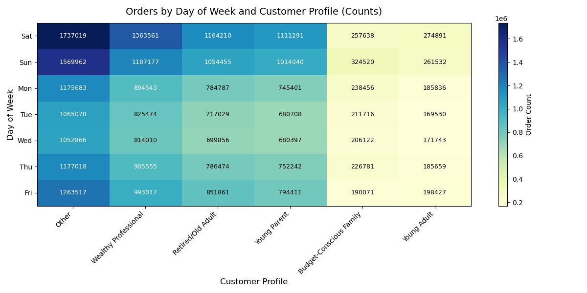

# Instacart-Grocery-Basket-Analysis
this repository is to share analysis of Instacart Grocery Basket.
# Instacart Grocery Basket Analysis (Python)

## 1. Project Summary
Instacart, an online grocery store that operates through an app, wants to uncover more information about their sales patterns. As a Data Analyst, I performed an initial exploratory data analysis to derive insights and suggest strategies for better customer segmentation as a part of my  CAREER FOUNDRY data analysis program.

**Goal:** To analyze customer purchasing behavior and uncover patterns for a targeted marketing strategy.

## 2. Key Questions
The marketing team requested answers to the following:
* What are the busiest days of the week and hours of the day?
* Are there particular times of the day when people spend the most money?
* With the (now simplified) price range groupings, which departments have the highest frequency of product orders?
* What’s the distribution among users in regards to their loyalty?
* Are there differences in ordering habits based on a customer’s region, age, income, or family status?

## 3. Data & Tools
The project utilized several open-source datasets from Instacart. I also used a "Customer" dataset (created for the purpose of this project) to answer questions regarding demographics.

**Libraries used:**
* **Pandas:** For data manipulation and analysis.
* **NumPy:** For mathematical operations.
* **Matplotlib & Seaborn:** For data visualization.
* **Scipy:** For statistical analysis.

## 4. Methodology
The analysis followed a rigorous data science workflow:
1. **Data Wrangling:** Renamed columns, changed data types to save memory, and dropped unnecessary columns.
2. **Data Consistency Checks:** Checked for mixed-type data, missing values, and duplicate records.
3. **Combining Data:** Merged multiple datasets (Orders, Products, and Customers) using shared identifiers.
4. **Deriving Variables:** Created flags for "loyalty," "spending," and "order frequency" using conditional logic.
5. **Customer Profiling:** Segmented customers based on age, income, and family status to identify high-value groups.

## 5. Visualizations
Below are key visualizations generated during the analysis to identify peak ordering times and customer distribution:

*Example: This bar chart identifies Saturday (0) and Sunday (1) as the peak ordering days.*

## 6. Key Insights & Recommendations
* **Peak Hours:** Orders peak between 10 AM and 4 PM, while spending remains consistent throughout the day.
* **Customer Loyalty:** "Regular Customers" make up the largest segment, suggesting a need for incentives to convert them into "Loyal Customers."
* **Regional Trends:** Marketing efforts should be tailored by region, as ordering habits for specific departments (like Produce and Dairy) vary by location.
* **Targeting:** Ads should be scheduled during low-volume hours (e.g., late night/early morning) to minimize costs while maintaining visibility.

## 7. Project Deliverables
* **[Jupyter Notebooks]:** Contains the full Python scripts for cleaning, merging, and analysis.
